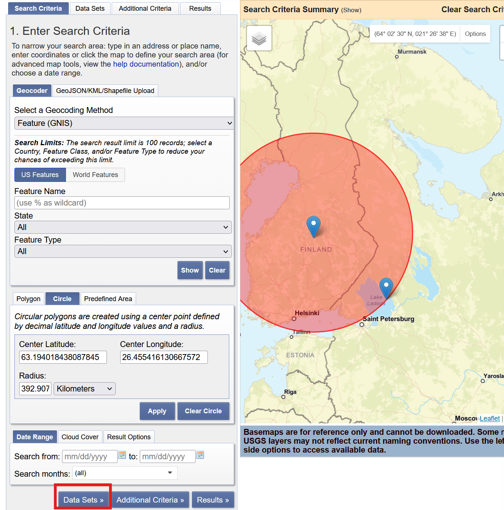
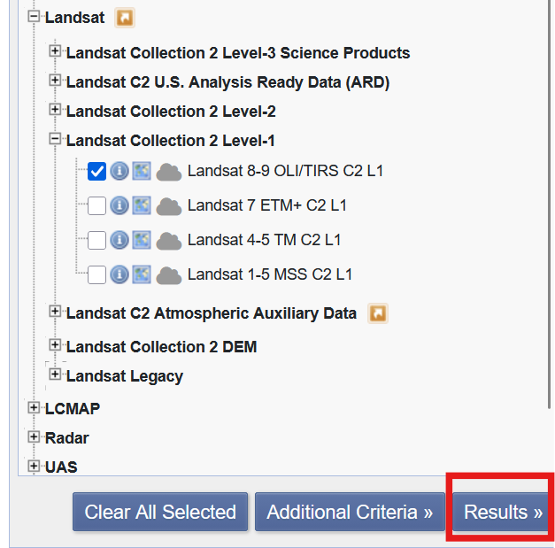
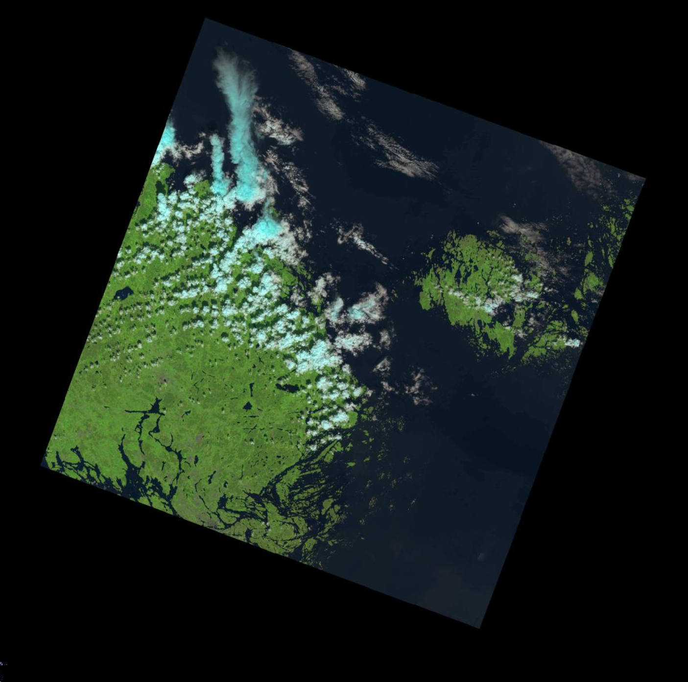
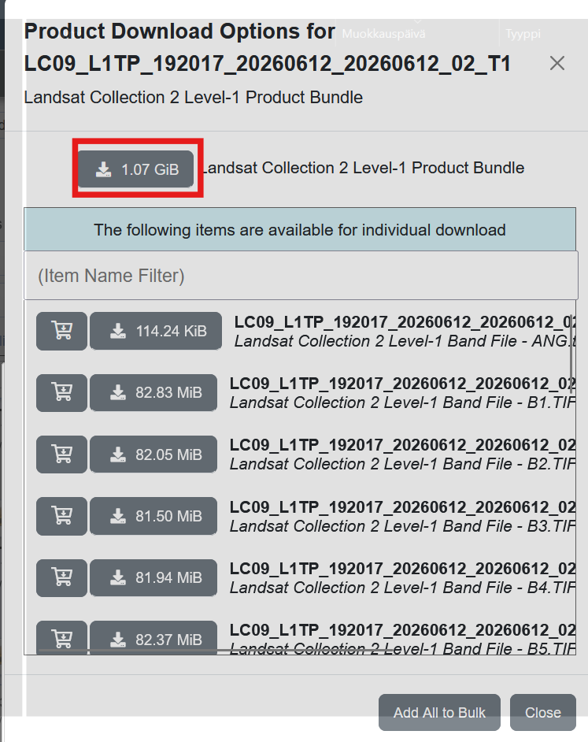

# Thermal data viewer
The purpose of this project is to visualize thermal data based on satellite images. This is a learning project to understand how we can use real data and display it on a front-end map. 

This project uses technologies like:
- React, Typescript.
- FastAPI, Python.
- Data handling libraries, like numpy, matplotlib and rasterio with Python.

## How to use

### Fetching satellite data from EarthExplorer

The first step is to download data from [USGS EarthExplorer](https://earthexplorer.usgs.gov/). There is also a sample image called LC08_L1TP_107035_20150806_20200908_02_T1_B10.tif, which you can use to test the application out. If you don't want to download a new satellite image set, you can [skip to the next step](#converting-the-image-for-usage).

You need to make a new account to the site. To search for an specific area, the easy way would be to use area tool to select an area with a polygon or a circle. Just select the points you want, and press the "Data Sets" to search for data for that area.





> Note: The satellite image might not be exactly in the exact area but it shows the approximate area.

From the data set selection screen, do the following steps:
1. Select the Landsat tab.
2. Select Landsat Collection 2 Level-1. 
3. Select Landsat 8-9 OLI/TIRS C2 L1.

Press the "Results" button from the bottom. 



You will now see previews of satellite imagery. Find a preview, that contains little amount of clouds and you can see the ground from the image. The image rarely perfect, so it can contain some clouds. Here is an example of an usable image.



To download the image, press the button next to it with the little green arrow pointing downwards to a hard disk to see download options. Click the "Product Options" tab and you will see a listing **Download the whole bundle!** The file size should be between 500 megabytes to 2 gigabytes.



After extracting, you see a bunch of files with different bands but for this project (currently) we are using the Band 10. **The file name should end in _T1_B10.tif**

> Note: The image is in black and white before converting, so don't panic.

### Converting the image for usage

#### Optional: Create and Activate a Virtual Environment

It is highly recommended to isolate your project dependencies using a virtual environment. Navigate to the root directory of the project and run:

```bash
python -m venv .venv
```

To activate the environment, run the appropriate command for your operating system:

Windows (PowerShell):

```powershell
.venv\Scripts\Activate.ps1
```

Linux / macOS:


```bash
source .venv/bin/activate
```

#### Step 1: Dependencies
If you have not installed the required packages, run:

```bash
pip install -r requirements.txt
```

#### Step 2: Configure the converter

Open the thermalconverter.py file inside the ImageRadianceConvert/ folder. Set the thermal_image_path variable to point to the directory where you downloaded the Band 10 (_B10.tif) file.

### Step 3: Would be to run the converter

Run the converter. Here you will notice that it won't probably work. 

This is why:
1. The converter is hard coded to work in a spesific coordinate in Tokio.
2. The maps need to be converted in a specific way, so that they work correctly in the front-end application.
3. The idea is that the converter should work for all coordinates but it is currently development, **thus the pilot phase**

Move the generated npy file to backend/data_thermal.

## Starting the application

Navigate to Application/backend/, where you will find a FastAPI application.

Run this in a separate terminal using the command

```bash
uvicorn main:app --reload
```


