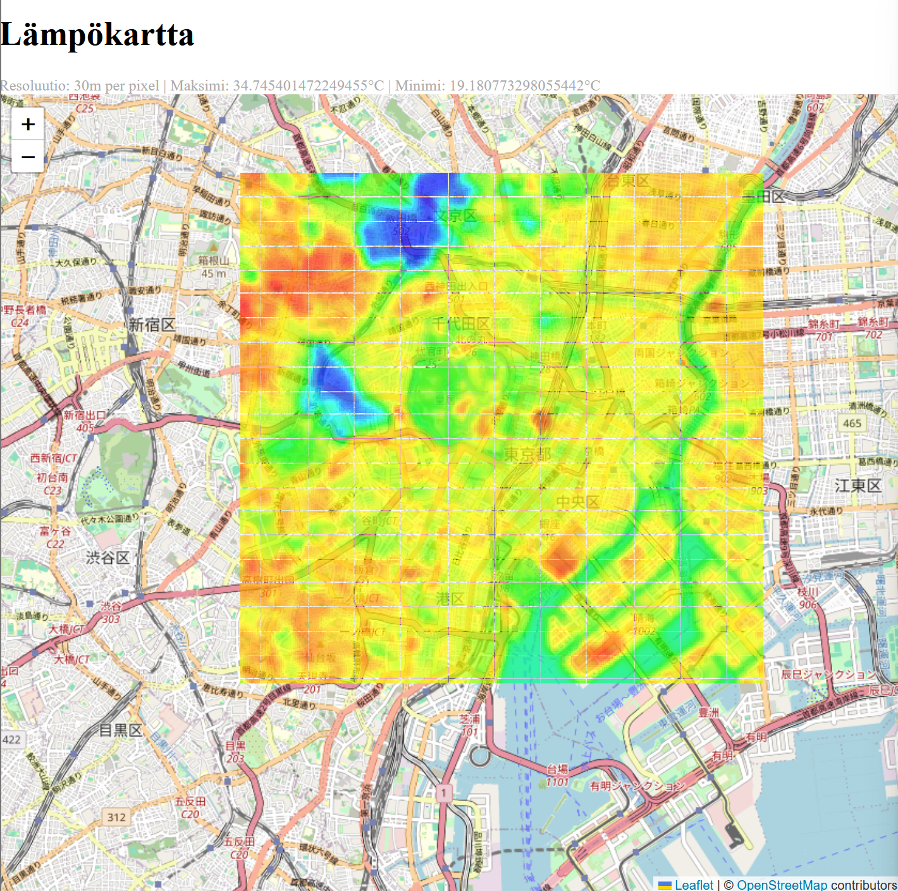

# Thermal data viewer

A full-stack geospatial web application designed to visualize thermal data based on satellite images. This project transforms raw Landsat 8-9 Band 10 (TIRS) GeoTiff data into heatmaps rendered over a modern front-end map interface.

This project was built to explore real-world data processing, geospatial coordinate mapping and to see what full-stack data handling would look like in the real world.

Tech Stack:
* **Frontend**: React, Typescript, Vite, Leaflet
* **Backend**: Python, FastAPI, Uvicorn
* **Data processing**: Numpy, Matplotlib, Rasterio

## How to use

### Fetching satellite data from EarthExplorer

To test the application, you can use the provided sample file `LC08_L1TP_107035_20150806_20200908_02_T1_B10.tif`. If you don't want to download a new satellite image set, you can [skip to the next step](#converting-the-image-for-usage). 

To fetch new data, follow these steps:

The first step is to download data from [USGS EarthExplorer](https://earthexplorer.usgs.gov/). You need to make a new account to the site. 

To search for an specific area, the easy way would be to use area tool to select an area with a polygon or a circle. Just select the points you want, and press the "Data Sets" to search for data for that area.


> Note: The satellite image might not be exactly in the exact area but it shows the approximate area.

From the data set selection screen, do the following steps:
1. Select the Landsat tab.
2. Select Landsat Collection 2 Level-1. 
3. Select Landsat 8-9 OLI/TIRS C2 L1.

Press the "Results" button from the bottom. 


You will now see previews of satellite imagery. Find a preview, that contains little amount of clouds and you can see the ground from the image. The image rarely perfect, so it can contain some clouds. Here is an example of an usable image.


To download the image, press the button next to it with the little green arrow pointing downwards to a hard disk to see download options. Click the "Product Options" tab and you will see a listing **Download the whole bundle!** The file size should be between 500 megabytes to 2 gigabytes.


After extracting, you see a bunch of files with different bands but for this project (currently) we are using the Band 10. **The file name should end in _T1_B10.tif**

The resulting image should look black and white. Each pixel contains data. The lighter the pixel, the more heat it contains. This data can be used to construct a heat map for the area.

### Converting the image for usage

#### Optional: Create and Activate a Virtual Environment

It is highly recommended to isolate your project dependencies using a virtual environment. Navigate to the root directory of the project and run:

```bash
python -m venv .venv
```

To activate the environment, run the appropriate command for your operating system:

Windows (PowerShell):

```powershell
.venv\Scripts\Activate.ps1
```

Linux / macOS:


```bash
source .venv/bin/activate
```

#### Step 1: Dependencies
If you have not installed the required packages, run:

```bash
pip install -r requirements.txt
```

#### Step 2: Configure the converter

Open the thermalconverter.py file inside the ImageRadianceConvert/ folder. Set the thermal_image_path variable to point to the directory where you downloaded the Band 10 (_B10.tif) file.

### Step 3: Would be to run the converter

1. Run the converter.

```bash
python thermalconverter.py
```

Move the generated npy file to backend/data_thermal.

**Current pilot phase roadmap:**

The converter is currently optimized for a specific bounding box coordinate set in Tokyo. Standardizing the pipeline to dynamically parse and re-project any global coordinate system (GeoTIFF CRS transformation) is currently under active development.


## Starting the application

### Backend

Navigate to Application/backend/, where you will find a FastAPI application.

Run this in a separate terminal using the command

```bash
uvicorn main:app --reload
```

This should start the application on http://127.0.0.1:8000

### Frontend

Navigate to Application/frontend/thermal-map, where you will find a React application.

Install the required packages with the command

```bash
npm install
```

Run this in a separate terminal using the command

```bash
npm run dev
```

This should start the application on http://localhost:5173/

> Note: Both frontend and backend applications have to be running at the same time.

## Testing the application

Open up the front-end running on http://localhost:5173/

If you used the original tokio_celcius.npy file (or you used the original .tif file), you should see a thermal map that was generated using the satellite image.



## Roadmap and upcoming optimizations

This project is under active development. Future goals include:
* **Dynamic coordinate reprojection**: Implementing automatic coordinate conversion to support uploads from any global coordinates.
* **Performance optimization**: Converting large JSON/Matrix HTTP payloads into compressed tile layers to drastically reduce front-end load times and memory consumption.
* **Dockerization**: Adding a `docker-compose.yml` file to spin up the entire local environment with a single command.

## Contributing

If you want to contribute, feel free to fork or add pull requests.